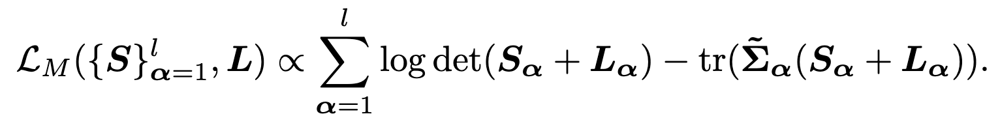
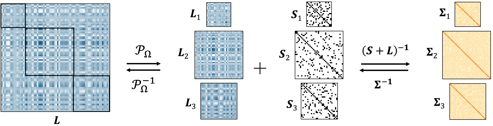

All code and experiments reproducing the results in *A Latent Multilayer Graphical Model For Complex, Interdependent Systems*. This repository is organized as following:

**Core** - Code implementing all methods, as well as additional helper functions. multiSLICE functions include `multislice.R`, `slice.R`, and `cv.multislice.R`.

**Figures** - Figures for Github `README.md`.

**Simulations** - Contains all simulation code, organized into subdirectories for each simulation.

## Methodology

We propose a multilayer latent Gaussian graphical model. We are interested in maximizing the following multilayer Gaussian likelihood function, 

<p align="center">
  
</p>

A visual summary of the data generating and parameter estimation processes is shown below.

<p align="center">
  
</p>

## Implementation

The main method is `multislice` in the *Core* directory, which takes the following arguments:

- `Sigmas` is a list of the $l$ layer symmetric sample covariance matrices $\{\mathbf{\tilde{\Sigma}}_{\alpha}\}_{\alpha=1}^l$.
- `rhos` is either a single $\rho$ value, or a vector of $\rho$ values of length $l$, to enforce sparsity in $\hat{\mathbf{S}}_{\alpha}$.
- `rank` is the rank of the joint low-rank space, $r$, for $\hat{\mathbf{L}}$.
- `Sest` is the type of sparse estimator to use; either `"glasso"`, `"clime"`, `"gscad"`, or `"huge_glasso"`. By default, `"glasso"` is used.
- `tol` is the tolerance for the stopping criteria. By default, `1e-3` is used.
- `maxiter` is the maximum number of iterations for the algorithm(s). By default, `100` is used.

`multislice` requires `R >= 4.4.0` and the following libraries:

```
install.packages(c("clime", "glasso", "huge", "RSpectra", "Matrix", "pracma"))
```

## Simulated data study

We consider two challenging simulation studies, which are motivated by structures in neuroimaging (Yatsenko et al., 2015). We compare our method with CNJGL (2014; Mohan et al.), MLGGM (2016; Lin et al.), BJEMGM (2019; Gan et al.), CFR (2021; Price et al.), BANS (2021; Ha et al.), JMMLE (2022; Majumdar and Michailidis), LRGQ (2022; Chang et al.), and coglasso (2024; Albanese et al.).

<figure align="center">
  
  <figcaption style="font-size:90%; text-align:center; margin-top:0.5em;">
    Effects of changing <i>l</i> (the number of layers, simulation 1) and <i>R(L*)</i> (the rank of the latent parameter matrix, simulation 2). F1 score (higher is better), and <i>sin θ(û₁, u₁*)</i> (lower is better) are computed for each estimate, and each simulation is repeated 100 times.
  </figcaption>
</figure>

## Multimodal neuroimaging data study

We apply multiSLICE and related methods to a multimodal neuroimaging dataset from Wakeman and Henson (2015). In this dataset, 16 subjects are scanned during the presentation of three different face stimuli. "Famous" and "Unfamiliar" faces are those of people who are publicly well known and those of people who are not, respectively. The "Scrambled" group is a set of images that have the outline or general shape of a face, but are filled in with white noise; these images serve as a control stimulus.

To compare sparse estimates, we use modularity, *Q*, (Bullmore and Sporns, 2009), which is a measurement of how well communities are separated within the intralayer graphs, where higher values are preferred. To compare latent estimates, we use the multilayer von Neumann entropy, *H*, (De Domenico et al., 2015), where lower values are preferred, indicating a higher order in the network.

<table style="font-size:90%; width:100%; border-collapse:collapse; text-align:center;">
  <thead>
    <tr>
      <th></th>
      <th colspan="2">Famous</th>
      <th colspan="2">Unfamiliar</th>
      <th colspan="2">Scrambled</th>
    </tr>
    <tr>
      <th></th>
      <th><i>Q</i></th>
      <th><i>H</i></th>
      <th><i>Q</i></th>
      <th><i>H</i></th>
      <th><i>Q</i></th>
      <th><i>H</i></th>
    </tr>
  </thead>
  <tbody>
    <tr>
      <td style="text-align:left;">CNJGL (2014)</td>
      <td>0.107 (9.65e-03)</td>
      <td>N/A</td>
      <td>0.106 (1.01e-02)</td>
      <td>N/A</td>
      <td>0.104 (1.08e-02)</td>
      <td>N/A</td>
    </tr>
    <tr>
      <td style="text-align:left;">BJEMGM (2019)</td>
      <td>0.084 (1.25e-02)</td>
      <td>N/A</td>
      <td>0.084 (9.09e-03)</td>
      <td>N/A</td>
      <td>0.079 (1.27e-02)</td>
      <td>N/A</td>
    </tr>
    <tr>
      <td style="text-align:left;">LRGQ (2022)</td>
      <td>0.112 (1.21e-01)</td>
      <td>1.29 (6.63e-02)</td>
      <td>0.122 (1.18e-01)</td>
      <td>1.29 (6.38e-02)</td>
      <td>0.130 (1.07e-01)</td>
      <td>1.28 (7.09e-02)</td>
    </tr>
    <tr>
      <td style="text-align:left;">multiSLICE (ours)</td>
      <td><strong>0.170 (1.86e-03)</strong></td>
      <td><strong>0.626 (4.53e-02)</strong></td>
      <td><strong>0.171 (1.64e-03)</strong></td>
      <td><strong>0.631 (4.02e-02)</strong></td>
      <td><strong>0.170 (1.28e-03)</strong></td>
      <td><strong>0.660 (1.17e-01)</strong></td>
    </tr>
  </tbody>
</table>

